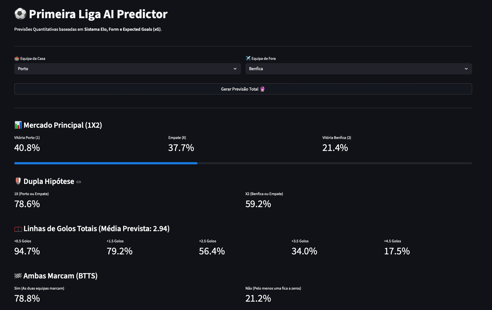

# ⚽ Primeira Liga AI Predictor

Um projeto de Machine Learning focado na previsão quantitativa de resultados de futebol da Primeira Liga Portuguesa. 

Este sistema não se baseia apenas em médias básicas. O algoritmo utiliza dados históricos, o sistema de ranking **Elo**, estatísticas avançadas de forma (como Streaks e janelas de *Expected Goals*) e um motor de **Time Decay (Decaimento Exponencial)** para forçar a Inteligência Artificial a dar prioridade à forma atual das equipas em vez do histórico distante.




---

## ✨ Funcionalidades do Modelo (Dashboards)

A Web App consulta 3 modelos de Inteligência Artificial em tempo real para apresentar estatísticas para diferentes mercados:

* 📊 **Mercado Principal (1X2)**: Probabilidades matemáticas de Vitória da Casa, Empate ou Vitória de Fora usando um `XGBClassifier`.
* 🛡️ **Dupla Hipótese (1X / X2)**: Conversão matemática das probabilidades para coberturas seguras.
* 🥅 **Linhas de Golos Totais (Over/Under)**: Previsão do volume esperado de golos através de um `XGBRegressor`, cruzado com a **Distribuição de Poisson** para calcular as *odds* exatas de +0.5 a +4.5 golos.
* 🏁 **Ambas Marcam (BTTS)**: Um terceiro modelo focado exclusivamente em prever se o jogo terá uma dinâmica tática aberta (Ambas Marcam: Sim) ou fechada (Ambas Marcam: Não).

---

## 🛠️ Ferramentas e Tecnologias Utilizadas

A *stack* tecnológica foi desenhada para análise de dados eficiente e um *deploy* rápido do front-end:

* **Python 3**
* **Pandas & NumPy** (Manipulação e Engenharia de Dados)
* **Scikit-Learn** (Métricas e pré-processamento)
* **XGBoost** (Motor principal de Machine Learning: Regressão e Classificação)
* **Streamlit** (Criação da Web App / Front-end interativo)

---

## 📂 Estrutura do Projeto

O repositório está organizado da seguinte forma para garantir a separação entre o laboratório de dados e a aplicação final:

```text
├── data/                               # Bases de dados (bruta e processada)
├── modelos/                            # Ficheiros .pkl (Os "cérebros" treinados)
│   ├── colunas.pkl
│   ├── modelo_xgboost.pkl
│   ├── modelo_xgboost_btts.pkl
│   └── modelo_xgboost_golos.pkl
├── 0_preparar_dados_mestre.ipynb       # Pipeline de limpeza de dados
├── 1_analise_exploratoria.ipynb        # Treino, testes de Accuracy e simulação de ROI
├── 2_robot_atualizao.ipynb             # Script para puxar resultados novos
├── app.py                              # Código fonte da Web App (Streamlit)
├── requirements.txt                    # Dependências do projeto
└── README.md
